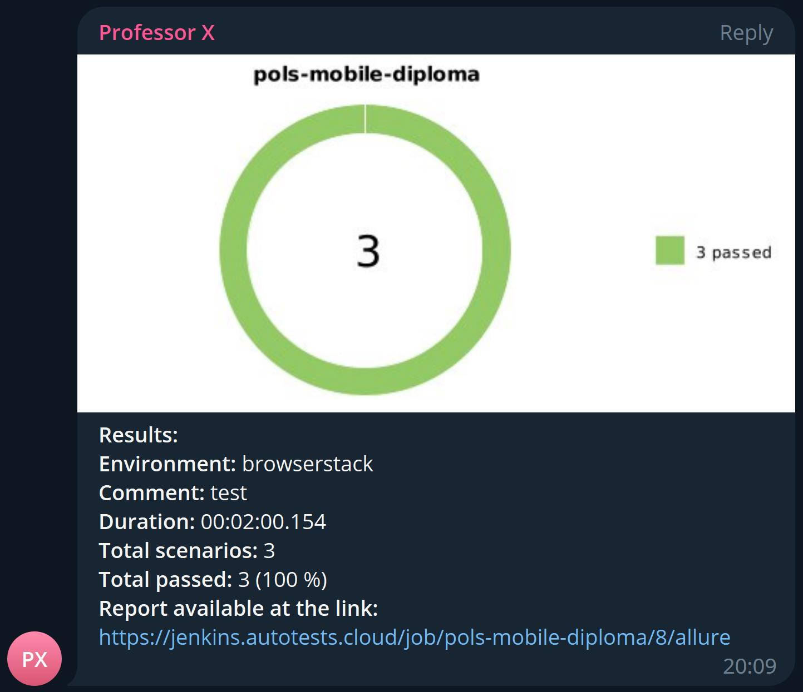
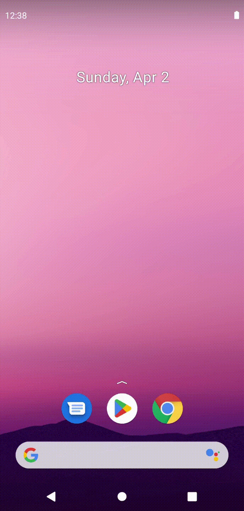

# Проект по автоматизации мобильного тестирования
<p align="center">
<a href="https://www.wikipedia.org/"></a>
</p>

## :card_file_box: Содержание
- [Технологии и инструменты](#bookmark-технологии-и-инструменты)
- [Запуск из терминала](#bookmark-запуск-тестов-из-терминала)
- [Сборка в Jenkins](#bookmark--jenkins--job-)
- [Allure отчет](#bookmark--отчет-в-allure-report)
- [Уведомление в Telegram](#bookmark--уведомление-в-telegram)
- [Видео прохождения тестов](#bookmark--видео-прохождения-некоторых-тестов)
- [Allure TestOps](#bookmark--добавление-интеграции-с-allure-testops)

## :bookmark: Технологии и инструменты
<p align="center">
<a href="https://www.jetbrains.com/idea/"></a>
<a href="https://www.java.com/"></a>
<a href="https://github.com/"></a>
<a href="https://junit.org/junit5/"></a>
<a href="https://gradle.org/"></a>
<a href="https://selenide.org/"></a>
<a href="https://github.com/allure-framework/allure2"></a>
<a href="https://www.jenkins.io/"></a>
<a></a>
<a></a>
<a></a>
<a></a>
<a></a>
</p>

## :bookmark: Запуск тестов из терминала
Локальный запуск:
```
gradle clean appium_test/browserstack_test -DdeviceHost=appium/browserstack
```

Удаленный запуск:
```
clean browserstack_test -DdeviceHost=browserstack
```
## :bookmark: </a> Jenkins <a target="_blank" href="https://jenkins.autotests.cloud/job/pols-mobile-diploma/8/"> job </a>

## :bookmark: </a> Отчет в <a target="_blank" href="https://jenkins.autotests.cloud/job/pols-mobile-diploma/8/allure/">Allure report</a>

### Обзор сборки
<p align="center">

</p>

### Тесты
<p align="center">

</p>

### :bar_chart: Графики
<p align="center">

</p>

## :bookmark: </a> Уведомление в Telegram
<p align="center">

</p>

## :bookmark: Видео прохождения тестов

### </a> Browserstack

<p align="center">
  
</p>

### </a> Local

<p align="center">
  
</p>

<p align="center">
  
</p>

<p align="center">
  
</p>

## :bookmark: </a> Добавление интеграции с Allure TestOps
<a target="_blank" href="https://allure.autotests.cloud/launch/21508">Job</a>

### Allure TestOps Dashboard
<p align="center">
  
</p>
